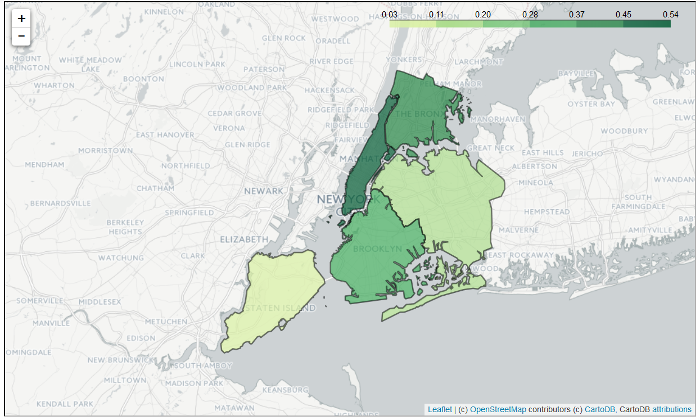
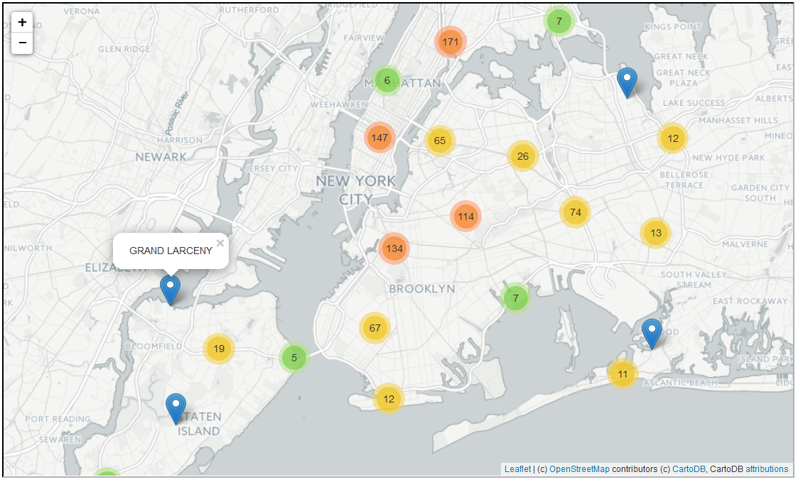
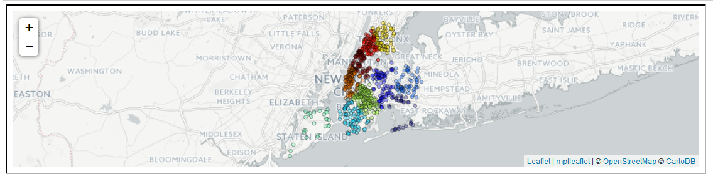
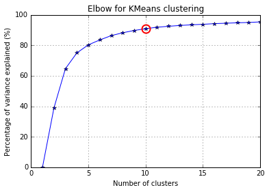
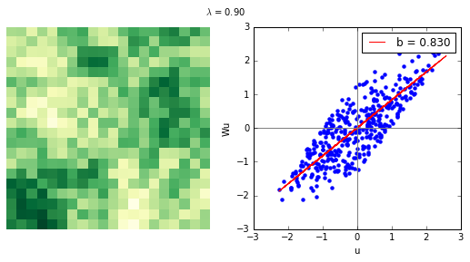

# Geospatial analyses of crime hotspots with IBM dashDB using iPython notebooks

The importance of crime data analysis has played an important role in public safety. The New York city police department
has gathered a huge amount of data over a period of 10 years and more and categorized the7major felonies committed in
the city of New York. We can analyze this huge dataset with efficient IBM enabled tools and services to gain meaningful
insights from the data. The major crime hotspots can be found with the help of in-database analytics package for IBM
dashDB developed in Python and further spatio-temporal analyses can be performed on the data using open source Python
packages like __‘geopandas’__ which depends on ‘shapely’ and 'pandas' for converting geospatial data into a dataframe
like structure for easier analyses and visualisation.Here we describe a use case for spatio-temporal analyses of
crime data using dashDB, in-database analytics package called __‘ibmdbpy’__ and visualizing the results with the help of
a few open source python packages – __‘folium’__ and __‘matplotlib’__.


```python
import sys
sys.path.extend(['C:\\Users\\IBM_ADMIN\\Anaconda2\\Lib\\site-packages\\ibmdbpy'])
```


```python
# Import packages needed for analysis
import ibmdbpy
from ibmdbpy import IdaDataFrame, IdaDataBase, IdaGeoDataFrame
import pandas as pd
import matplotlib as mpl
import folium,ggplot,mplleaflet
import matplotlib.pyplot as plt
import plotly.plotly as py
from pylab import rcParams
rcParams['figure.figsize'] = (25,10)
%matplotlib inline
from ggplot import *
from IPython.display import display
print('All libraries imported!')
```

    All libraries imported!


Analysis with geopandas - elementwise operations on geometry, is pretty slow!


```python
import geopandas as gp
from geopandas import GeoSeries,GeoDataFrame
dsn = 'C:/Users/IBM_ADMIN/Documents/IBM_Internship/crimeDataAnalyses/'
%time nyc_boroughs = GeoDataFrame.from_file(dsn + 'shapefiles4326/nyc_boroughs.shp')
nyc_boroughs.set_index('BoroName', inplace=True)
%time felonies = GeoDataFrame.from_file(dsn + 'nypd7majorfelonies/nypd7majorfelonies1.shp')
felonies.set_index('Identfr')
robberies_2015 = felonies.loc[felonies['Occrr_Y']==2015]
robberies_2015 = robberies_2015.loc[robberies_2015['Offense']== 'ROBBERY',('Precnct','Sector','geometry')]
robberies_2015.shape
```

    Wall time: 233 ms
    Wall time: 2min 26s


    (16886, 3)


Find the number of robberies and area of each borough using shapely operations within and area with Geopandas


```python
%time nyc_boroughs['boro_area'] = nyc_boroughs.geometry.area
# Find the count of each type of crimes within each borough
% time robberies_2015['within_SI'] = robberies_2015.geometry.apply(lambda x: x.within(nyc_boroughs.geometry.iloc[0]))
% time robberies_2015['within_QN'] = robberies_2015.geometry.apply(lambda x: x.within(nyc_boroughs.geometry.iloc[1]))
% time robberies_2015['within_BK'] = robberies_2015.geometry.apply(lambda x: x.within(nyc_boroughs.geometry.iloc[2]))
% time robberies_2015['within_MH'] = robberies_2015.geometry.apply(lambda x: x.within(nyc_boroughs.geometry.iloc[3]))
% time robberies_2015['within_BR'] = robberies_2015.geometry.apply(lambda x: x.within(nyc_boroughs.geometry.iloc[4]))
si = len(robberies_2015.loc[robberies_2015['within_SI']== True])
qn = len(robberies_2015.loc[robberies_2015['within_QN']== True])
bk = len(robberies_2015.loc[robberies_2015['within_BK']== True])
mh = len(robberies_2015.loc[robberies_2015['within_MH']== True])
br = len(robberies_2015.loc[robberies_2015['within_BR']== True])
count = [si,qn,bk,mh,br]
nyc_boroughs['no_of_robberies'] = count
nyc_boroughs.loc[:,('no_of_robberies','boro_area')]
```

    Wall time: 1e+03 µs
    Wall time: 1.87 s
    Wall time: 1min 35s
    Wall time: 1min 18s
    Wall time: 25 s
    Wall time: 24.4 s


<div>
<table border="1" class="dataframe">
  <thead>
    <tr style="text-align: right;">
      <th></th>
      <th>no_of_robberies</th>
      <th>boro_area</th>
    </tr>
    <tr>
      <th>BoroName</th>
      <th></th>
      <th></th>
    </tr>
  </thead>
  <tbody>
    <tr>
      <th>Staten Island</th>
      <td>456</td>
      <td>0.016046</td>
    </tr>
    <tr>
      <th>Queens</th>
      <td>3263</td>
      <td>0.030148</td>
    </tr>
    <tr>
      <th>Brooklyn</th>
      <td>5667</td>
      <td>0.019163</td>
    </tr>
    <tr>
      <th>Manhattan</th>
      <td>3155</td>
      <td>0.006308</td>
    </tr>
    <tr>
      <th>Bronx</th>
      <td>4344</td>
      <td>0.011776</td>
    </tr>
  </tbody>
</table>
</div>


Let us now use ibmdbpy to do a similar operation in a much faster manner.


```python
import getpass,jaydebeapi,jpype
uid = raw_input('Enter Username:')
pwd = getpass.getpass('Enter password:')
jdbc = 'jdbc:db2://dashdb-entry-yp-dal09-07.services.dal.bluemix.net:50000/BLUDB:user=' + uid + ';password=' + pwd
idadb = IdaDataBase(dsn = jdbc)
print('Connection to dashDB successful!')
```

    Enter Username:dash5548
    Enter password:········
    Connection to dashDB successful!


The NYC crime data which is already available on dashDB is retrieved as an IdaDataFrame similar to a pandas data frame.
The crime data is already geocoded and stored as ST_Point in dashDB. Along with it additional geospatial data for
defining the New York city boroughs are also loaded in dashDB, which will be used for further analyses.


```python
robberies_2015_by_boro = idadb.ida_query("select b1.\"BoroName\",a1.\"Identfr\",db2gse.st_area(b1.geo_data,'KILOMETER') " +
                                         "as area_in_sq_km from nyc_crime_data a1, nyc_boroughs b1 " +
                                         "where db2gse.st_within(a1.geo_data,b1.geo_data) = 1 " +
                                         "and a1.\"Offense\" = 'ROBBERY' and a1.\"Occrr_Y\" = 2015")
robberies_2015_by_boro.head()
```


<div>
<table border="1" class="dataframe">
  <thead>
    <tr style="text-align: right;">
      <th></th>
      <th>BoroName</th>
      <th>Identfr</th>
      <th>AREA_IN_SQ_KM</th>
    </tr>
  </thead>
  <tbody>
    <tr>
      <th>0</th>
      <td>Brooklyn                                      ...</td>
      <td>7776c45d                                      ...</td>
      <td>179.997796</td>
    </tr>
    <tr>
      <th>1</th>
      <td>Brooklyn                                      ...</td>
      <td>7f870862                                      ...</td>
      <td>179.997796</td>
    </tr>
    <tr>
      <th>2</th>
      <td>Bronx                                         ...</td>
      <td>fe20cfa0                                      ...</td>
      <td>110.270598</td>
    </tr>
    <tr>
      <th>3</th>
      <td>Brooklyn                                      ...</td>
      <td>45254fc6                                      ...</td>
      <td>179.997796</td>
    </tr>
    <tr>
      <th>4</th>
      <td>Brooklyn                                      ...</td>
      <td>8fe600ec                                      ...</td>
      <td>179.997796</td>
    </tr>
  </tbody>
</table>
</div>


Exploratory analysis using IdaDataFrames from ibmdbpy


```python
import numpy as np
%time nyc_crime_geo = IdaDataFrame(idadb,'NYC_CRIME_DATA',indexer = 'OBJECTID')
%time robberies_2015 = nyc_crime_geo[nyc_crime_geo['Offense']=='ROBBERY']
%time robberies_2015 = robberies_2015[robberies_2015['Occrr_Y'] == 2015]
%time robberies2015_brooklyn = len(robberies_2015[robberies_2015['Borough']=='BROOKLYN'])
%time robberies2015_bronx = len(robberies_2015[robberies_2015['Borough']=='BRONX'])
%time robberies2015_manhattan = len(robberies_2015[robberies_2015['Borough']=='MANHATTAN'])
%time robberies2015_queens = len(robberies_2015[robberies_2015['Borough']=='QUEENS'])
%time robberies2015_staten = len(robberies_2015[robberies_2015['Borough']=='STATEN ISLAND'])
%time robberies_count = [robberies2015_bronx,robberies2015_brooklyn,robberies2015_manhattan,robberies2015_queens,robberies2015_staten]
x = np.array([0,1,2,3,4])
y = np.array(robberies_count)
my_yticks = ['Bronx','Brooklyn','Manhattan','Queens','Staten Island']
plt.yticks(x, my_yticks)
%time plt.barh(x, y)
plt.title('Frequency Distribution of Robberies by Borough in 2015')
plt.xlabel('No. of Robberies')
plt.ylabel('Boroughs')
```

    Wall time: 302 ms
    Wall time: 1.89 s
    Wall time: 624 ms
    Wall time: 1.45 s
    Wall time: 1.45 s
    Wall time: 1.45 s
    Wall time: 1.42 s
    Wall time: 1.42 s
    Wall time: 0 ns
    Wall time: 4 ms


    <matplotlib.text.Text at 0xf577f390>


We can further analyse the spatio-temporal pattern of crimes over a period of past decade for each Precinct.
First we simply visualise the spatial distribution of the crimes as a scatterplot and cluster the crime locations based
on spatial proximity. Further for the temporal analyses we need to first format the raw data into a timeseries which
Python can understand and then visualise using the in-built matplotlib functions of pandas dataframe. Further, we can
also analyse the autocorrelation and lag in the data if any.


```python
idadf = IdaGeoDataFrame(idadb,'NYC_CRIME_DATA',indexer = 'OBJECTID',geometry = 'GEO_DATA')
idadf = idadf[idadf['Occrr_Y'] == 2015]
idadf= idadf[idadf['Offense'] == "BURGLARY"]
idadf['X'] = idadf.x() # Using the spatial function ST_X and ST_Y to extract the coordinates
idadf['Y'] = idadf.y()
df = idadf[['Identfr','Occrrnc_Dt','Offense','Precnct','Borough','X','Y']].as_dataframe()
df.plot(kind='scatter', x='X', y='Y', title = 'Spatial Distribution of Burglaries in 2015', figsize=[10,7])
```


    <matplotlib.axes._subplots.AxesSubplot at 0x397f6dd8>


Since the crime data is geocoded, we can use the geospatial functions from the python library geopandas to analyse the
geometry and then retrieve the results in the form of a choropleth map based upon the variation of crime density of each
borough. In order to achieve this, we first use the ST_Area function of dashDB spatial to obtain the area of each
borough in square meters. Following this, we find the number of crimes of type __"ROBBERY"__ in each borough in the year
__2015__ using the ST_Within function and finally compute the density for each borough and try to visualise the results
with __Leaflet__ library.


```python
# Read the data from dahsDB using ibmdbpy
import ibmdbpy
from ibmdbpy import IdaDataBase,IdaDataFrame,IdaGeoDataFrame
idadb = IdaDataBase('jdbc:db2://dashdb-entry-yp-dal09-07.services.dal.bluemix.net:50000/BLUDB:user=dash5548;password=Yc3HLDkUY2Ky')
robberies_2015 = IdaDataFrame(idadb,'ROBBERIES_BY_BORO_2015')
boros = IdaGeoDataFrame(idadb,'NYC_BOROUGHS',indexer = 'BoroCode')

#Set the geometry attribute and calculate area of the boroughs
boros.set_geometry('GEO_DATA')
boros['area_in_sq_km'] = boros.area(unit = 'KILOMETER')
boros_df = boros[['BoroName','BoroCode','area_in_sq_km']].as_dataframe()
boros_df.set_index('BoroCode')

# Find the count of robberies in each borough fo 2015
bronx = len(robberies_2015[robberies_2015['BoroName']=='Bronx'])
brooklyn = len(robberies_2015[robberies_2015['BoroName']=='Brooklyn'])
manhattan = len(robberies_2015[robberies_2015['BoroName']=='Manhattan'])
queens = len(robberies_2015[robberies_2015['BoroName']=='Queens'])
staten = len(robberies_2015[robberies_2015['BoroName']=='Staten Island'])
count = [staten,queens,brooklyn,manhattan,bronx]
boros_df['no_of_robberies'] = count

#Calculate the crime density
boros_df['crime_density'] = (boros_df['no_of_robberies']/boros_df['area_in_sq_km'])*0.01
#Generate choropleth map with folium
import folium, json
with open('NYCboros.json', 'r') as f:
     boros_geo = json.load(f)
robberies = boros_df[['BoroCode','crime_density']]
map1 = folium.Map(location= (40.709475, -74.00275),
                  zoom_start=10, tiles = 'cartodbpositron')
map1.choropleth(geo_str = boros_geo,
                data = robberies,
                columns = ['BoroCode', 'crime_density'],
                key_on = 'feature.properties.BoroCode',
                fill_color='YlGn',
                fill_opacity = 0.7,
                line_weight = 2,
                legend_name = 'Robbery densities by Borough')
map1
```





In order to visualise the locations in a much cleaner fashion, the open source library folium is used which displays the
clustered marker feature of the Leaflet library internally, and groups the locations with spatial proximity into
clusters using locality of reference.


```python
idadf = IdaGeoDataFrame(idadb,'NYC_CRIME_DATA',indexer = 'OBJECTID',geometry = 'GEO_DATA')
idadf = idadf[idadf['Occrr_Y'] == 2015]
idadf['X'] = idadf.x() # Using the spatial function ST_X and ST_Y to extract the coordinates
idadf['Y'] = idadf.y()
df = idadf[['Identfr','Occrrnc_Dt','Offense','Precnct','Borough','X','Y']].as_dataframe()
df['Offense'] = df['Offense'].apply(lambda x: x.strip())
df.head()
```


<div>
<table border="1" class="dataframe">
  <thead>
    <tr style="text-align: right;">
      <th></th>
      <th>Identfr</th>
      <th>Occrrnc_Dt</th>
      <th>Offense</th>
      <th>Precnct</th>
      <th>Borough</th>
      <th>X</th>
      <th>Y</th>
    </tr>
  </thead>
  <tbody>
    <tr>
      <th>1</th>
      <td>fd48ebd1                                      ...</td>
      <td>02/13/2015 06:00:00 AM                        ...</td>
      <td>GRAND LARCENY</td>
      <td>84</td>
      <td>BROOKLYN                                      ...</td>
      <td>-73.989808</td>
      <td>40.685663</td>
    </tr>
    <tr>
      <th>2</th>
      <td>c288c861                                      ...</td>
      <td>02/13/2015 06:00:00 AM                        ...</td>
      <td>BURGLARY</td>
      <td>107</td>
      <td>QUEENS                                        ...</td>
      <td>-73.807025</td>
      <td>40.710877</td>
    </tr>
    <tr>
      <th>3</th>
      <td>d648890e                                      ...</td>
      <td>02/13/2015 06:00:00 AM                        ...</td>
      <td>GRAND LARCENY</td>
      <td>6</td>
      <td>MANHATTAN                                     ...</td>
      <td>-74.009000</td>
      <td>40.730803</td>
    </tr>
    <tr>
      <th>4</th>
      <td>91fe53b4                                      ...</td>
      <td>02/13/2015 06:00:00 AM                        ...</td>
      <td>BURGLARY</td>
      <td>40</td>
      <td>BRONX                                         ...</td>
      <td>-73.914287</td>
      <td>40.811986</td>
    </tr>
    <tr>
      <th>5</th>
      <td>a10b35d1                                      ...</td>
      <td>02/13/2015 06:30:00 AM                        ...</td>
      <td>GRAND LARCENY OF MOTOR VEHICLE</td>
      <td>103</td>
      <td>QUEENS                                        ...</td>
      <td>-73.770047</td>
      <td>40.711383</td>
    </tr>
  </tbody>
</table>
</div>


```python
from folium.plugins import MarkerCluster
pop,loc = [],[]
#width, height = 310,110
for idx, row in df[1:1000].iterrows():
    loc.append([row['Y'], row['X']])
    #row['Offense'] = row['Offense'].strip(' ')
    pop.append(row['Offense'])

map1 = folium.Map(location= [40.709475, -74.00275],
                  zoom_start=7,
                  tiles = 'cartodbpositron')
map1.add_children(MarkerCluster(locations=loc,popups = pop))
map1
```





```python
from scipy.cluster.vq import kmeans2, whiten
import mplleaflet
df.set_index('Identfr')
df = df[1:1000]
arr = zip(df['X'],df['Y'])
arr = np.asarray(arr)
x, y = kmeans2(whiten(arr), 10, iter = 20)
ax = plt.scatter(arr[:,0], arr[:,1], c=y, alpha=0.33333)
mplleaflet.display(fig=ax.figure, tiles = 'cartodb_positron')
```



```python
# Find the minimum k that explains the maximum variance in the data
import numpy as np
from scipy.cluster.vq import kmeans
from scipy.spatial.distance import cdist,pdist
from sklearn import datasets
from sklearn.decomposition import RandomizedPCA
from matplotlib import pyplot as plt
from matplotlib import cm
% matplotlib inline
##### data #####
# load digits dataset
data = datasets.load_digits()
t = data['target']

# perform PCA dimensionality reduction
pca = RandomizedPCA(n_components=2).fit(data['data'])
X = pca.transform(data['data'])

##### cluster data into K=1..20 clusters #####
K_MAX = 20
KK = range(1,K_MAX+1)

KM = [kmeans(X,k) for k in KK]
centroids = [cent for (cent,var) in KM]
D_k = [cdist(X, cent, 'euclidean') for cent in centroids]
cIdx = [np.argmin(D,axis=1) for D in D_k]
dist = [np.min(D,axis=1) for D in D_k]

tot_withinss = [sum(d**2) for d in dist]  # Total within-cluster sum of squares
totss = sum(pdist(X)**2)/X.shape[0]       # The total sum of squares
betweenss = totss - tot_withinss          # The between-cluster sum of squares

##### plots #####
kIdx = 9        # K=10
clr = cm.spectral( np.linspace(0,1,10) ).tolist()
mrk = 'os^p<dvh8>+x.'

# elbow curve
fig = plt.figure()
ax = fig.add_subplot(111)
ax.plot(KK, betweenss/totss*100, 'b*-')
ax.plot(KK[kIdx], betweenss[kIdx]/totss*100, marker='o', markersize=12,
    markeredgewidth=2, markeredgecolor='r', markerfacecolor='None')
ax.set_ylim((0,100))
plt.grid(True)
plt.xlabel('Number of clusters')
plt.ylabel('Percentage of variance explained (%)')
plt.title('Elbow for KMeans clustering')
```


    <matplotlib.text.Text at 0x3970ba58>





Measure of Spatial Autocorrelation in the data using Moran's I from PySAL library


```python
def draw_map(lamb):
    s = 20
    n = s**2
    w = ps.lat2W(s, s, rook=False)
    w.transform = 'R'
    e = np.random.random((n, 1))
    u = inv(np.eye(n) - lamb * w.full()[0])
    u = np.dot(u, e)
    ul = ps.lag_spatial(w, u)
    u = (u - u.mean()) / np.std(u)
    ul = (ul - ul.mean()) / np.std(ul)
    gu = u.reshape((s, s))
    # Figure
    f = plt.figure(figsize=(9, 4))
    ax1 = f.add_subplot(121)
    ax1.matshow(gu, cmap=plt.cm.YlGn)
    ax1.set_frame_on(False)
    ax1.axes.get_xaxis().set_visible(False)
    ax1.axes.get_yaxis().set_visible(False)
    #---
    ax2 = f.add_subplot(122)
    sc = ax2.scatter(u, ul, linewidth=0)
    ols = ps.spreg.OLS(ul, u)
    tag = "b = %.3f"%ols.betas[1][0]
    ax2.plot(u, ols.predy, c='red', label=tag)
    ax2.axvline(0, c='0.5')
    ax2.axhline(0, c='0.5')
    ax2.legend()
    plt.xlabel('u')
    plt.ylabel('Wu')
    plt.suptitle("$\lambda$ = %.2f"%lamb)
    plt.show()
```


```python
import pysal as ps
import numpy as np
from scipy.linalg import inv
from IPython.html.widgets import interact
interact(draw_map, lamb=(-0.9, 0.9))
```




