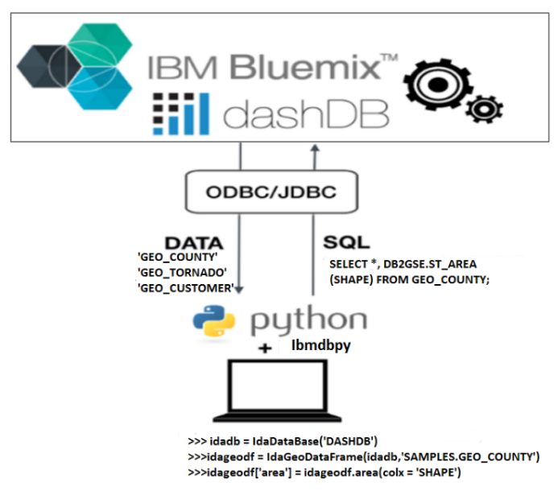
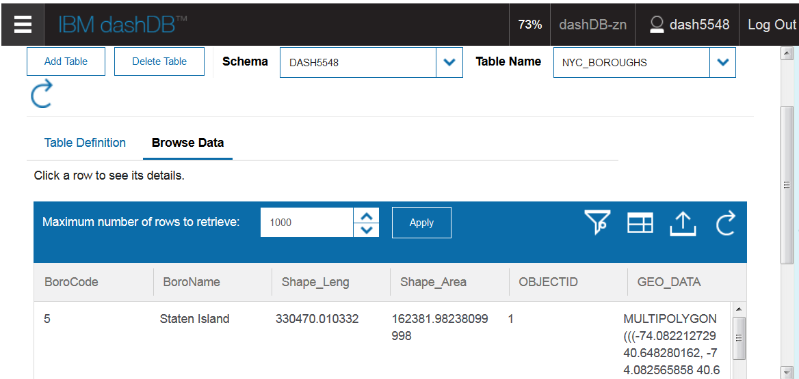
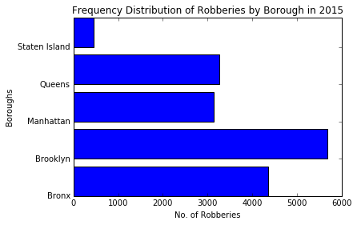
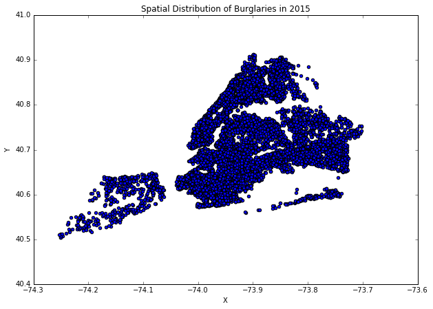
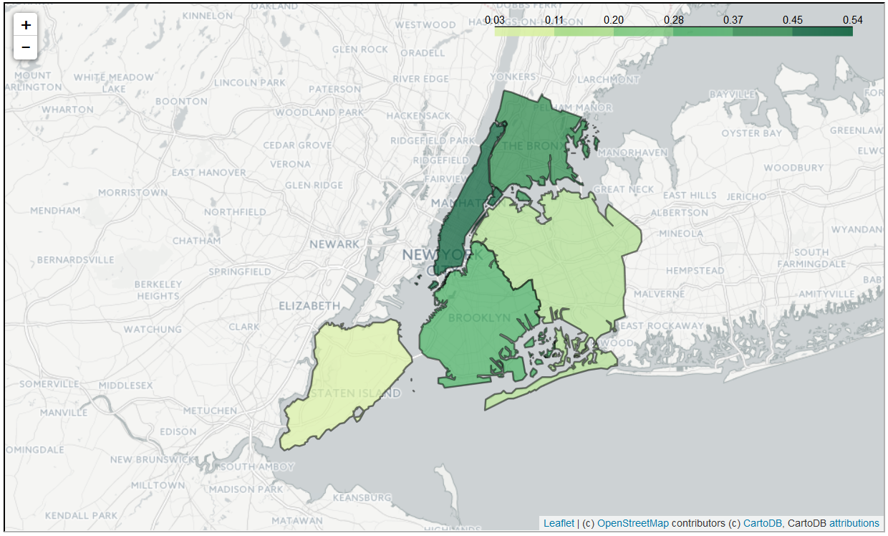

# Exploring geospatial In-database Analytics with IBM dashDB and ibmdbpy


Traditional approaches to data analysis require data to be moved out of the database or files into a separate
analytics environment for processing, and then back to the database or files, which is an expensive process.
Doing the analysis in a database, where the data resides, eliminates the costs, time and security
issues associated with the old approach by doing the processing in the data warehouse itself.

We have used the Python package [ibmdbpy](https://github.com/ibmdbanalytics/ibmdbpyhttps://github.com/ibmdbanalytics/ibmdbpy)
 to enable the process of in-database analytics with dashDB
and use it in Pandas-like syntax from Interactive Python notebooks.
The ibmdbpy package translates Pandas-like syntax into SQL and uses a middleware API
(pypyodbc/JayDeBeApi) to send it to an ODBC or JDBC-connected database for execution.
These SQL statements are translated to database queries at runtime as SQL pushdowns. 
The result is retrieved as a memory instance in the form of dataframes, which are
easy to manipulate for further exploratory analysis. It reduces execution time for reading
data and running complex queries on the data compared to fetching the entire dataset into
memory. It, therefore, avoids network overload and crashing of the notebook due to missing local memory.




## Getting started

Here we describe a simple example on how to use ibmdbpy with dashDB from notebooks especially with geospatial data.

1. Create a [Bluemix account.](http://www.ibm.com/developerworks/cloud/library/cl-bluemix-fundamentals-start-your-free-trial/)

2. Launch a new Jupyter notebook from the [apache spark service.](https://console.ng.bluemix.net/docs/services/AnalyticsforApacheSpark/index.html)

3. Import the package ibmdbpy ( If not installed, install it using pip command )

```
!pip install --user ibmdbpy
```

4. The first step is to setup a connection with the data source, which is dashDB in our case.
   It can be done in two ways either with jdbc (For Linux and MAc users) or with odbc (For Windows users)

   In order to setup a JDBC connection , the connection parameters from dashDB can be used along
   with the login credentials.  For a dashDB instance on Bluemix, the JDBC URL string can be found 
   on the dashDB Connection Information page.

```python
import ibmdbpy
from ibmdbpy import IdaDataBase
jdbc = "jdbc:db2://host_name:50001/BLUDB:user=user_name;password=password"
idadb = IdaDataBase(jdbc)
```

 
Using our previously opened IdaDataBase instance named ‘idadb’, we can open one or several IdaDataFrame objects. 
They behave like pointers to remote tables.

Let us open the iris data set, assuming it is stored in the database under the name ‘IRIS’.

FIXME: the iris data set is not pre-loaded to dashDB. Please use one of the preloaded samples, like SHOWCASE_SYSTEMS

```python
from ibmdbpy import IdaDataFrame
idadf = IdaDataFrame(idadb, 'IRIS')
```

We can very easily explore the data in the IdaDataFrame by using built in functions using pandas-like syntax ``IdaDataFrame.head()``

```python
idadf.head()
   sepal_length  sepal_width  petal_length  petal_width species
0           5.1          3.5           1.4          0.2  setosa
1           4.9          3.0           1.4          0.2  setosa
2           4.7          3.2           1.3          0.2  setosa
3           4.6          3.1           1.5          0.2  setosa
4           5.0          3.6           1.4          0.2  setosa
```

With the geospatial functions of ibmdbpy, we can also explore geospatial data using `IdaGeoDataFrame` objects.
The `IdaGeoDataFrame` objects contain geometries representing locations, trajectories or a regions based on the 
geospatial data types `POINT`, `LINESTRING` or `POLYGON`.

The following example reads a data from the dashDB's sample table 'GEO_CUSTOMER' containing customer locations.

```python
from ibmdbpy import IdaGeoDataFrame
idageodf = IdaDataFrame(idadb, 'SAMPLES.GEO_CUSTOMER')
idageodf.head()
 	OBJECTID  SHAPE 	                            NAME                INSURANCE_VALUE
 	1         POINT (-80.5561002596 40.1528103049) 	Felice Dicarlo      155263
 	2         POINT (-80.6569863704 40.0406902830) 	Aurelia Hussein     201204
 	3         POINT (-80.6247752421 40.1320339439) 	Hildegard Kittrell  260550
 	4         POINT (-80.7158029630 40.1151442910) 	Arletta Henne       278992
 	5         POINT (-80.6682444120 40.1808573446) 	Elvia Shadrick      190152

# Set the geometry attribute for the IdaGeoDataFrame for further analyses
idageodf.set_geometry('SHAPE')
```

Now, if we want to compute the distance between two locations we can do the following:

```python
from ibmdbpy import IdaGeoDataFrame
ida1 = idageodf[idageodf['OBJECTID']==1]
ida2 = idageodf[idageodf['OBJECTID']==2]
res = ida1.distance(ida2)
res.head()
 	INDEXERIDA1  INDEXERIDA2 RESULT
 	1            2           0.150827

```
Again, we can use the filter operations in ibmdbpy to find the customer with the highest insurance value 

```python
ida = IdaGeoDataFrame(idadb,'SAMPLES.GEO_CUSTOMER')
ida['INSURANCE_VALUE'].max()

INSURANCE_VALUE  2999967

```
## A simple use case

The following use case works with the spatial functionality of ibmdbpy to analyze crimes committed in the city of New York.
The New York city police department has gathered a huge amount of data over a period
of 10 years and more and categorized the 7major crime types (felonies) committed in the city of New York.

The dataset is provided by New York City police department and
[available in NYC Open Data](https://data.cityofnewyork.us/Public-Safety/NYPD-7-Major-Felony-Incidents/hyij-8hr7/data)
 
We can analyze this huge dataset efficiently with `ibmdbpy` to gain meaningful insights from
the data. The major crime hotspots can be then visualized with the help of `folium` and `matplotlib`.

The data is available as a csv file so it had to be geocoded and transformed to a new spatial reference system WGS84
and converted to a *.shp format before loading to dashDB.
For Example, you can follow the steps [here](http://www.ibm.com/developerworks/data/library/techarticle/dm-0604uleman/) 
to convert the (x,y) coordinates to an ST_POINT geometry in dashDB.
Also, [this post](https://developer.ibm.com/bluemix/2015/08/03/location-location-location/) might be helpful.

Once the NYC crime data is available on dashDB, we can take a look at it from within our notebook:

We can then look up the data inside dashDB where new tables will be added in your schema.



The crime data is stored as ST_Point in dashDB. In addition additional geospatial data for
defining the New York city boroughs are also loaded in dashDB from [here] (http://www1.nyc.gov/site/planning/data-maps/open-data/districts-download-metadata.page), which will be used for further analysis.


1. Before we start our analysis we load all required libraries into our notebook:


```
!pip install --user ibmdbpy
```
```python
# Import packages needed for analysis
import ibmdbpy 
from ibmdbpy import IdaDataFrame, IdaDataBase, IdaGeoDataFrame
import matplotlib as mpl
import folium,ggplot,mplleaflet
import matplotlib.pyplot as plt
%matplotlib inline
print('All libraries imported!')
```

    All libraries imported!


2. Let us now connect to our dashDB datasource with a JDBC connection.


```python
import getpass,jaydebeapi,jpype
uid = raw_input('Enter Username:')
pwd = getpass.getpass('Enter password:')
jdbc = 'jdbc:db2://dashdb-entry-yp-dal09-07.services.dal.bluemix.net:50000/BLUDB:user=' + uid + ';password=' + pwd
idadb = IdaDataBase(dsn = jdbc)
print('Connection to dashDB successful!')
```

    Enter Username:dash5548
    Enter password:········
    Connection to dashDB successful!


3. The crime data is retrieved as an `IdaGeoDataFrame` which is similar to a `pandas` data frame. 
The process of data retrieval and spatial analysis is much faster with `ibmdbpy` with the added advantage of lazy-loading.
When compared to some well known spatial analysis libraries like `shapely` and `geopandas`, which usually need an additonal 
installation of GDAL and reads the data directly into memory.

FIXME: add the loop into the example

```python
import numpy as np
%time nyc_crime_geo  = IdaGeoDataFrame(idadb,'NYC_CRIME_DATA',indexer = 'OBJECTID')
%time robberies_2015 = nyc_crime_geo[nyc_crime_geo['Offense']=='ROBBERY']
%time robberies_2015 = robberies_2015[robberies_2015['Occrr_Y'] == 2015]
%time robberies2015_brooklyn = len(robberies_2015[robberies_2015['Borough']=='BROOKLYN'])
%time robberies2015_bronx = len(robberies_2015[robberies_2015['Borough']=='BRONX'])
%time robberies2015_manhattan = len(robberies_2015[robberies_2015['Borough']=='MANHATTAN'])
%time robberies2015_queens = len(robberies_2015[robberies_2015['Borough']=='QUEENS'])
%time robberies2015_staten = len(robberies_2015[robberies_2015['Borough']=='STATEN ISLAND'])
%time robberies_count = [robberies2015_bronx,robberies2015_brooklyn,robberies2015_manhattan,robberies2015_queens,robberies2015_staten]
x = np.array([0,1,2,3,4])
y = np.array(robberies_count)
my_yticks = ['Bronx','Brooklyn','Manhattan','Queens','Staten Island']
plt.yticks(x, my_yticks)
%time plt.barh(x, y)
plt.title('Frequency Distribution of Robberies by Borough in 2015')
plt.xlabel('No. of Robberies')
plt.ylabel('Boroughs')
```




4. In the next step we analyze the spatial distribution of crimes over a period of past
decade and display it as scatterplot .

```python
idadf = IdaGeoDataFrame(idadb,'NYC_CRIME_DATA',indexer = 'OBJECTID',geometry = 'GEO_DATA')
idadf = idadf[idadf['Occrr_Y'] == 2015]
idadf= idadf[idadf['Offense'] == "BURGLARY"]
idadf['X'] = idadf.x() # Using the spatial function ST_X and ST_Y to extract the coordinates
idadf['Y'] = idadf.y()
df = idadf[['Identfr','Occrrnc_Dt','Offense','Precnct','Borough','X','Y']].as_dataframe()
df.plot(kind='scatter', x='X', y='Y', title = 'Spatial Distribution of Burglaries in 2015', figsize=[10,7])
```





5. Since the crime data has location data, we can use the geospatial functions from the python library geopandas
to analyse the geometry and then retrieve the results in the form of a choropleth map based upon the
variation of crime density of each borough. In order to achieve this, we first find the number of crimes within each borough 
of type __"ROBBERY"__ in each borough in the year __2015__ using the `within` function and then use the `area()` function from ibmdbpy spatial to obtain the area of each borough in square kilometers. We finally compute the density of robberies for each 
borough and try to visualise the results with __Leaflet__ using the `folium` library.


```python
# Read the data from dahsDB using ibmdbpy
import ibmdbpy
from ibmdbpy import IdaDataBase,IdaDataFrame,IdaGeoDataFrame,IdaGeoSeries
#idadb = IdaDataBase('jdbc:db2://dashdb-entry-yp-dal09-07.services.dal.bluemix.net:50000/' +
                     'BLUDB:user=dash5548;password=Yc3HLDkUY2Ky')
boros = IdaGeoDataFrame(idadb,'NYC_BOROUGHS',indexer = 'OBJECTID')
felonies = IdaGeoDataFrame(idadb,'NYC_CRIME_DATA',indexer = 'OBJECTID')

#Set the geometry attribute and calculate area of the boroughs
boros.set_geometry('GEO_DATA')
felonies.set_geometry('GEO_DATA')
boros['area_in_sq_km'] = boros.area(unit = 'KILOMETER')
boros_df = boros[['BoroName','BoroCode','area_in_sq_km']].as_dataframe()


# Find the count of robberies in each borough fo 2015
felonies = felonies[felonies['Offense']=='ROBBERY']
robberies_2015 = felonies[felonies['Occrr_Y']==2015]
bronx = boros[boros['BoroName']=='Bronx']
brooklyn = boros[boros['BoroName']=='Brooklyn']
manhattan = boros[boros['BoroName']=='Manhattan']
queens = boros[boros['BoroName']=='Queens']
staten = boros[boros['BoroName']=='Staten Island']

result_bronx = robberies_2015.within(bronx)
result_brooklyn = robberies_2015.within(brooklyn)
result_manhattan = robberies_2015.within(manhattan)
result_queens = robberies_2015.within(queens)
result_staten = robberies_2015.within(staten)

bronx_count = result_bronx[result_bronx['RESULT']==1].shape[0]
manhattan_count = result_manhattan[result_manhattan['RESULT']==1].shape[0]
brooklyn_count = result_brooklyn[result_brooklyn['RESULT']==1].shape[0]
queens_count = result_queens[result_queens['RESULT']==1].shape[0]
staten_count = result_staten[result_staten['RESULT']==1].shape[0]
boros_df = boros[['OBJECTID','BoroCode','BoroName','area_in_sq_km']].as_dataframe()
boros_df['robberies_2015'] = [staten_count,queens_count,brooklyn_count,manhattan_count,bronx_count]

#Calculate the crime density
boros_df['crime_density'] = (boros_df['robberies_2015']/boros_df['area_in_sq_km'])*0.01
#Generate choropleth map with folium
import folium, json
with open('NYCboros.json', 'r') as f:
     boros_geo = json.load(f)
robberies = boros_df[['BoroCode','crime_density']]
map1 = folium.Map(location= (40.709475, -74.00275),
                  zoom_start=10, tiles = 'cartodbpositron')
map1.choropleth(geo_str = boros_geo,
                data = robberies,
                columns = ['BoroCode', 'crime_density'],
                key_on = 'feature.properties.BoroCode',
                fill_color='YlGn',
                fill_opacity = 0.7,
                line_weight = 2,
                legend_name = 'Robbery densities by Borough')
map1
```



As you can see `ibmdbpy` greatly facilitates your data analysis in python as it can analyze a huge and complex datasets
in an efficient manner using in-database analytics.

